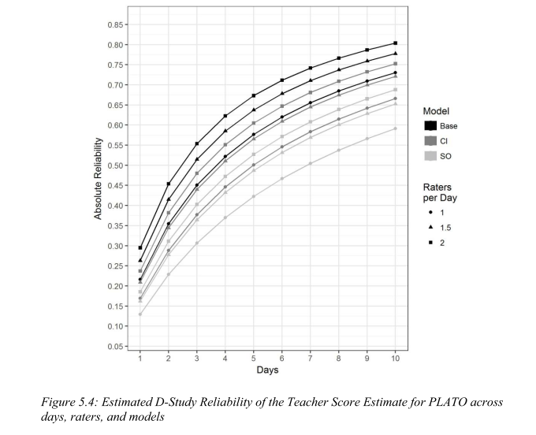

```{r setup, include=FALSE}
knitr::opts_chunk$set(echo = FALSE)
require(tidyverse)
require(psych)
require(GPArotation)
require(reshape2)
load(file.path("data","Dat_Video_wHF.rData"))

Videot <- subset(Videot, grepl("PLATO",variable)) %>%
      select(DistrictID,SchoolID,TeacherID,SectionID,LessonID,SegID,ScoreType,
             Subject,Grade,Observer,variable,value,VAM_T_Reg6,Sec_VAM,Sec_PriorAch) %>%
      mutate(DistrictID = paste0("D"  ,as.integer(DistrictID)),
             SchoolID   = paste0("S"  ,as.integer(SchoolID  )),
             TeacherID  = paste0("T"  ,as.integer(TeacherID )),
             SectionID  = paste0("Sec",as.integer(SectionID )),
             LessonID   = paste0("D"  ,as.integer(LessonID  )),
             SegID      = paste0("Seg",as.integer(SegID     )),
             Observer   = paste0("R"  ,as.integer(Observer  )) ) %>%
      reshape2::dcast(DistrictID+SchoolID+TeacherID+SectionID+LessonID+SegID+ScoreType+
           Grade+Observer+VAM_T_Reg6+Sec_VAM+Sec_PriorAch~variable, value.var="value") %>%
  group_by(TeacherID,LessonID,SegID) %>% mutate(N=1:n()) %>% ungroup
names(Videot) <- sub("PLATO_","",names(Videot))
Videot <- Videot %>% mutate(M= (PURP+INTC+RC+CPK+CPE+MOD+GP+ESI+CD+TBI+ALL+BMN+TMN)/13)
  
```

## Housekeeping {.smaller}

- Set up totscore.isr.umich.edu accounts
    - You should have received emails to set up an account.
    - You must do this within 9 hours.  Please do it now if you have a computer.
- Discussion Board Post for Projects
    - We will adapt some aspects of this class to hit topics related to class projects
    - But only if we know about your thoughts
    - Even if you only have half-formed ideas, start a post with your thoughts
- Website for demonstrations: https://github.com/mrkwht/MeasurementOfTeaching

## Protocol for Language Arts Teaching Observation

- Modern Measure of Quality of Instruction in ELA lessons
- 13 items scored by raters
- Scored every 15 minutes
- Our goal is to measure teacher quality

## Understanding Teaching Quality Project

- 228 Middle School ELA teachers with Video and Live Scoring
- Six observers
- Four videos per teacher with 2 segments per video

## Empirical Setup

- We observe $X$
- Observation occurs on
    - Given Teacher ($t$)
    - Given Day ($d$)
    - Given Segment ($s$)
    - by Given Rater ($r$)
    - Given Item ($i$)

Thus, $X_{tdsri}$

## Empirical Setup

By classical test theory: $X=T+E$

Reliability is $var(T)/var(X) = var(T)/(var(X)+var(E))$

Different Reliability Estimates Specify Different Measurement Error Sources

- Alpha - items
- Inter-Rater Reliability - raters
- ...

## Empirical Setup

Given Observed ($X_{tdsri}$) and Error Source ($E_i$) the True Score takes on a specific form ($T_{tdsr}$)

Thus, each given reliability model implies a specific scope for the True Score. That is, the reliability model, by defining sources of error, specifies what is being measured.

## View of PLATO data {.smaller}

```{r cars, echo = F}
DT::datatable(Videot, width=800, height=850, 
              options=list(pageLength=10, scrollX='400px'))
```

## PLATO score reliability: Alpha {.smaller}

```{r alpha, echo=T}
select(Videot, PURP, INTC, RC, CPK, CPE, MOD, GP, ESI, CD, TBI, 
       ALL, BMN, TMN) %>% alpha %>% {(.)$total} %>% round(2)
```

Alpha if Item Removed

```{r alpha2, echo=F}
select(Videot, PURP, INTC, RC, CPK, CPE, MOD, GP, ESI, CD, TBI, ALL, BMN, TMN) %>% alpha %>% {(.)$alpha.drop} %>% select(raw_alpha, std.alpha, average_r) %>% round(2)
```

## PLATO scores reliability: Omega

<div class="columns-2">

```{r omega, echo=F, fig.width=4, }
select(Videot, PURP, INTC, RC, CPK, CPE, MOD, GP, ESI, CD, TBI, ALL, BMN, TMN) %>% omega(plot=T) %>% invisible
```

```{r omega2, echo=T}
Videot %>% select(PURP, INTC, RC, CPK, 
  CPE, MOD, GP, ESI, CD, TBI, ALL, BMN, 
  TMN) %>% omega(plot=F) %>% 
  {(.)[c("omega_h","omega.tot")]}
```

</div>

## Alpha's Assumption on Error

>- What is the source of error?
>- What does the true score represent?
>- Are Errors independent across raters?


## Rater Specific Alphas {.smaller}

```{r alpha_rater, echo=T}
Videot %>% 
  select(PURP, INTC,RC,CPK,CPE,MOD,GP,ESI,CD,TBI,ALL,BMN,TMN) %>% 
  {by(.,Videot$Observer, function(x) alpha(x)$total %>% round(2))} %>%
  {plyr::ldply(.)}
```

## Inter-Rater Reliability (IRR)

Simple Correlation Approach

```{r IRR, echo=T}
  Videot %>% 
  dcast(TeacherID+SectionID+LessonID+SegID~ScoreType,value.var="M") %>%
  select(Regular,Live,Double) %>%
  cor(use="pair")
```

- Correlation Aggregated to Teacher: `r Videot %>% mutate(M= (PURP+INTC+RC+CPK+CPE+MOD+GP+ESI+CD+TBI+ALL+BMN+TMN)/13) %>% group_by(TeacherID,ScoreType) %>% summarise(M=mean(M,na.rm=T)) %>% dcast(TeacherID~ScoreType,value.var="M") %>% {cor((.)$Regular,(.)$Double,use="pair")}`
- ICC Version: `r summary(lme4::lmer(M~1+(1|SegID)+(1|Observer),Videot))$varcor %>%     as.data.frame %>% summarise(IRR=vcov[1]/sum(vcov)) %>% unname`

## Rater Specific Inter-Rater Reliability

```{r IRR_RatSpec, echo=F}
Videot %>% 
  mutate(M= (PURP+INTC+RC+CPK+CPE+MOD+GP+ESI+CD+TBI+ALL+BMN+TMN)/13) %>%
  dcast(SegID~Observer,value.var="M") %>%
  select(-SegID) %>%
  cor(use="pair") %>%
  {d3heatmap::d3heatmap(., width=900, height=500)}
```


## IRR's Assumption on Error

>- What is the source of error?
>- What does the true score represent?

## Inter-Lesson

Simple Correlation Approach

```{r InterLesson, echo=T}
Videot %>% 
  select(SectionID,LessonID,M) %>%
  group_by(SectionID,LessonID) %>% 
  summarise(M=mean(M,na.rm=T)) %>%
  group_by(SectionID) %>% mutate(N=1:n()) %>%
  dcast(SectionID~N,value.var="M") %>%
  select(`1`,`2`) %>%
  cor(use="pair")
```

- ICC Version: `r Videot %>% group_by(LessonID,SegID) %>% summarise(M=mean(M,na.rm=T)) %>% ungroup %>% {lme4::lmer(M~1+(1|LessonID),.)} %>% summary %>% {.$varcor} %>%     as.data.frame %>% summarise(IRR=vcov[2]/sum(vcov)) %>% unname`
- Across Sections Version: `r Videot %>% group_by(TeacherID,SectionID) %>% summarise(M=mean(M,na.rm=T)) %>% group_by(TeacherID) %>% mutate(N=paste0("v",1:n())) %>% dcast(TeacherID~N,value.var="M") %>% select(v1,v2) %>% cor(use="pair") %>% {(.)[1,2]}`

## Test-Retest Reliability's Assumption on Error

>- What is the source of error?
>- What does the true score represent?

## Generalizability Approach

- Depends on Number of Days Observed and Raters Scoring Teachers

 
 
## asdf
 
 

## Limits on Generalizability Approach

>- What is the source of error?
>- What does the true score represent?
>- What errors are not captured?
>    - Schools?
