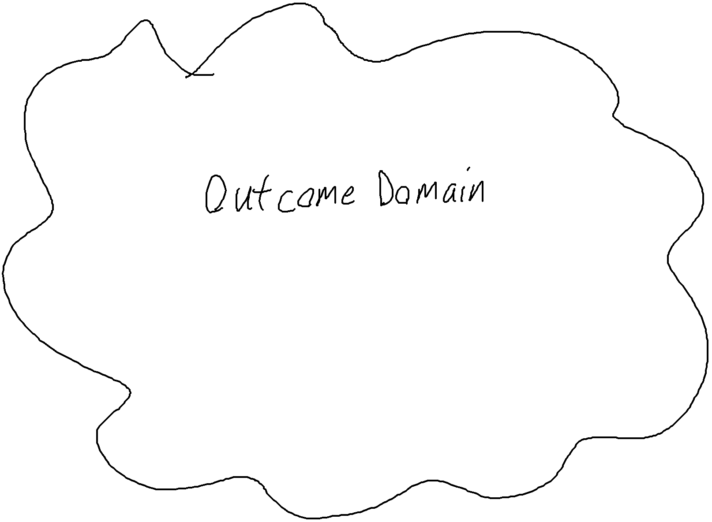
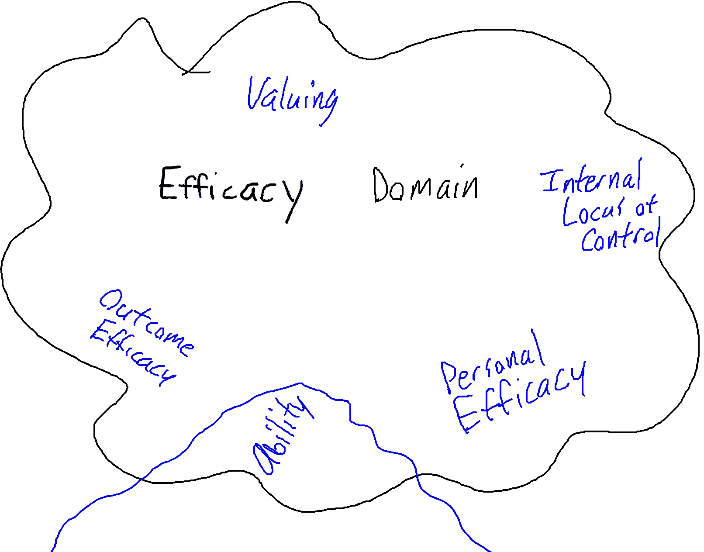
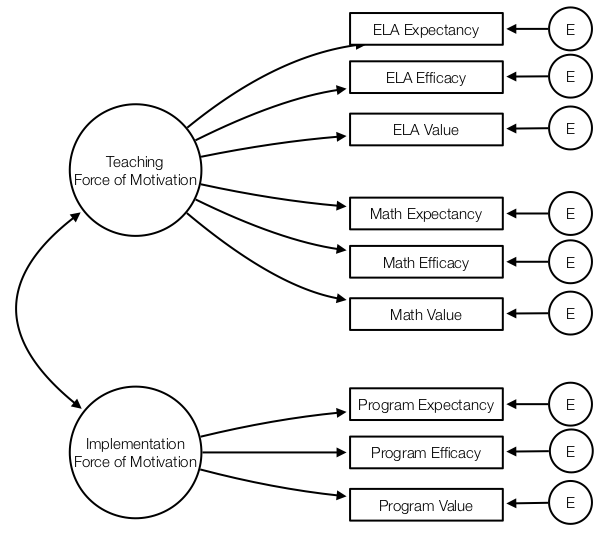
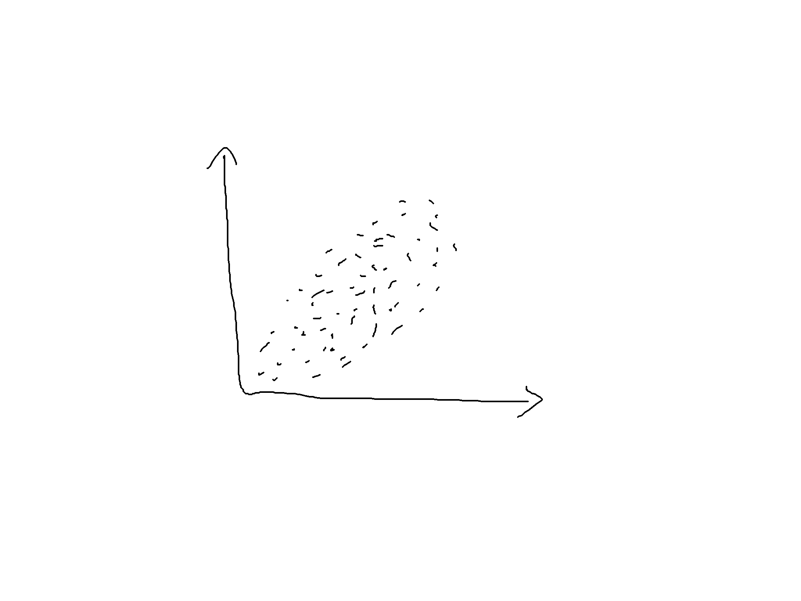
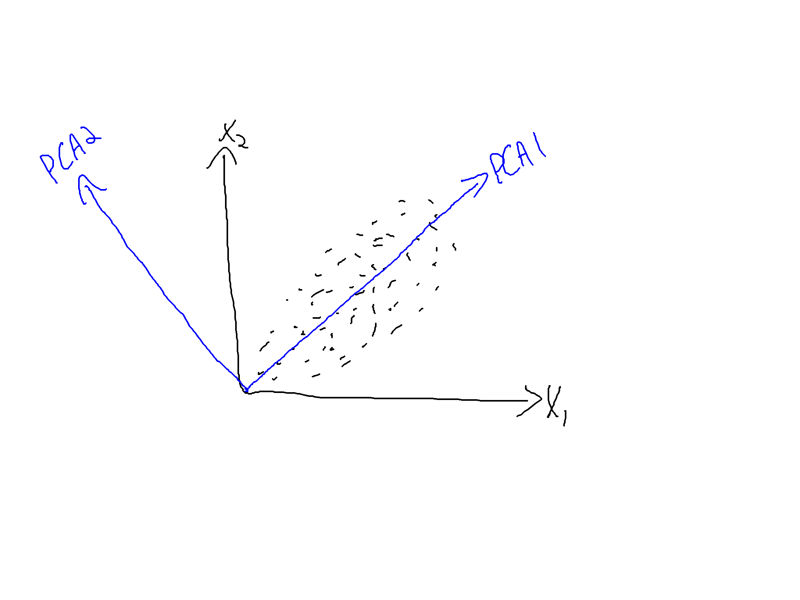
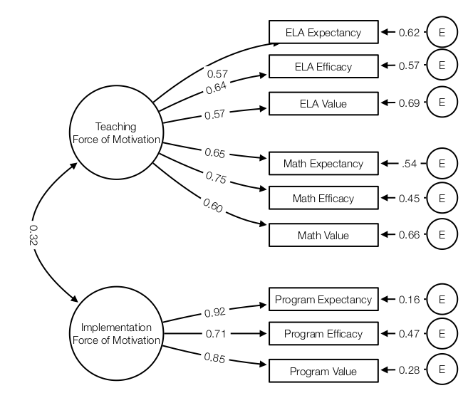

```{r setup, include=FALSE}
knitr::opts_chunk$set(echo = FALSE)
require(knitr)
require(kableExtra)
require(tidyverse)
require(psych)
require(GPArotation)
require(reshape2)

source('../../../Research/R libraries/DefaultScriptMark.R')
load(file.path("..","data","Teacher_Questionnaire.rData"))

Teacher01 <- Teacher01 %>% 
  select(respid, dstrctid,schoolid,dc_year,y1status,rsltdate, # intv,
         tq1_10a,tq1_10b,tq1_10c,tq1_30a,tq1_30b,tq1_30c,tq1_48a,tq1_48d,tq1_48b,
         InASP=tq1_46a, InAC=tq1_46b, InRnW=tq1_46c, InSFA=tq1_46d, InOther=tq1_46e) %>%
  dplyr::rename(ELA_Exp="tq1_10a", ELA_Eff="tq1_10b", ELA_Value="tq1_10c",
                Mth_Exp="tq1_30a", Mth_Eff="tq1_30b", Mth_Value="tq1_30c",
                Prg_Exp="tq1_48b", Prg_Eff="tq1_48a", Prg_Value="tq1_48d")
Teacher01 <- lapply(Teacher01, function(x) {
  attr(x, "label") <- NULL
  attr(x, "class") <- grep("labelled",attr(x,"class") ,invert=T,value=T)
  x
  } ) %>% as.data.frame
rm(Teacher02,Teacher03,Teacher04)

FactVars <- Teacher01 %>% 
  select(ELA_Exp, ELA_Eff, ELA_Value, Mth_Exp, Mth_Eff, Mth_Value, Prg_Exp, Prg_Eff, Prg_Value)

```

## Roadmap - Factor Analysis (FA)

- Review Efficacy Items
- Why Factor Analysis?
- Factor Anaysis versus Classical Test Theory
- FA versus Principal Components Analysis
- Number of Factors, Extraction, and Rotation

## Teacher Efficacy Items {.vcenter}

Our previous analysis suggested that 'force of motivation' for program implementation may vary from 'force of motivation' for subject instruction, suggesting two dimensions of 'force of motivation'.

## Teacher Efficacy Items {.smaller}

- ELA and Math
    - Most Students can learn what I am supposed to teach (*Expectancy*)
    - By trying different methods, I can affect achievement (*Efficacy*)
    - I feel satisfaction when students learn (*Value*)
- Program
    - I am capable of making changes called by by the program (*Efficacy*)
    - The changes called for by the program help my students achieve (*Expectancy*)
    - I value changes called for by program (*Value*)

## Why Factor Analysis? {.smaller}

- Often we want to measure something, but cannot directly observe it
    - e.g. teacher efficacy
- In this case, we can 
    - Theoretically postulated the existence of the latent construct
    - Design items capturing 'observable' characteristics influenced by the latent construct
    - Infer a score for the latent construct based on responses to items related to that construct
- Factor Analysis addresses the questions:
    - Is there empirical evidence for the hypothesized construct?
    - Are there additional constructs that also influence scores on many items?

## Domain Sampling



## Domain Sampling



## CTT vs FA {.smaller}

Classical Test Theory: 

$$
X_i=T+E_i
$$ 

Factor Analysis: 

$$
X_i=\mu_i+\sum_j^J{\lambda_i*F_j}+E_i
$$

$\Longrightarrow$

$$
T \equiv  \mu_i+\sum_j^J{\lambda_i*F_j}
$$

- Errors Remain Same
- If all items have same mean ($\mu_i=\mu$), there is one factor ($J=1$), and all loadings are 1 ($\lambda_i=1$), models are equivalent.
- FA as relaxing assumptions of CTT

## Factor Structure



## FA versus PCA  {.columns-2}

Imagine we observe two highly correlated variables as shown to the right. What does PCA do?




## FA versus PCA {.columns-2}

PCA simply tilts axes.  Instead of having axes X~1~ and X~2~, we get axes PCA~1~ and PCA~2~.  We can then choose to only use PCA~1~ to represent the data (with some loss of information).  There is no mathematical model, no way of determining fit to a model, and no characterization of the error of measurement.



## Number of Factors

```{r, message=F, warning=F, fig.height=6, fig.width=8}
ParallelAnalysis(FactVars) %>% invisible
```

## Missing Data Concerns

```{r, warning=F, fig.width=8, fig.height=5.2}
VIM::aggr(FactVars,cex.lab=1,numbers=T)
```

## Sample Size

- Full Sample: `r nrow(FactVars)`
- Rows with All Data: `r nrow(na.omit(FactVars))`
- Average Pairwise Sample:
    - ELA-Math: `r sapply(1:3, function(i) sapply(4:6, function(j) return(nrow(na.omit(FactVars[,c(i,j)]))))) %>% c %>% harmonic.mean`
    - ELA-Prog: `r sapply(1:3, function(i) sapply(7:9, function(j) return(nrow(na.omit(FactVars[,c(i,j)]))))) %>% c %>% harmonic.mean`
    - Math-Prog: `r sapply(4:6, function(i) sapply(7:9, function(j) return(nrow(na.omit(FactVars[,c(i,j)]))))) %>% c %>% harmonic.mean`
    

## Factor Analysis 

<div class="columns-2">
<div class="column">

```{r FA, message=F, echo=T}
FA<-fa(qgraph::cor_auto(FactVars),
   n.obs=nrow(FactVars),
   nfactors=2,
   rotate="none",
   fm="minres",
   n.iter=5)
```

</div><div class="column">

- cor_auto - polychoric correlations
- MinRes - similar to ML, but robust
- No Rotation
- n.iter - get SD through bootstrap

</div></div>

## Factor Analysis

Variance Explained by Two Factors:

```{r, echo=F}
FA$Vaccounted
```

## Factor Loadings (no rotation) {.flexbox .vcenter}

```{r, echo=F, results="asis"}
data.frame(`F~1~` =FA$cis$means[,"MR1"],
           `SE~1~`=FA$cis$sds[,"MR1"],
           `F~2~` =FA$cis$means[,"MR2"],
           `SE~2~`=FA$cis$sds[,"MR2"],
           Uniqness=FA$uniquenesses,
           Communality=FA$communality,
           check.names=F) %>%
  round(2) %>% {knitr::kable(.)}
```

<style>
th, td {
  text-align: center;
  width: 75px;
}

tr:nth-child(3) {
  border-bottom: 1px solid black;
  border-collapse: collapse;
}
tr:nth-child(6) {
  border-bottom: 1px solid black;
  border-collapse: collapse;
}
th {
  border-bottom: 1px solid black;
  border-collapse: collapse;
}
</style>

## Oblimin Rotation {.flexbox .vcenter}

```{r, echo=F, results="asis", message=F}
FA<-fa(qgraph::cor_auto(FactVars),
   n.obs=nrow(FactVars),
   nfactors=2,
   rotate="oblimin",
   fm="minres",
   n.iter=5, scores=T)

data.frame(`F~1~` =FA$cis$means[,"MR1"],
           `SE~1~`=FA$cis$sds[,"MR1"],
           `F~2~` =FA$cis$means[,"MR2"],
           `SE~2~`=FA$cis$sds[,"MR2"],
           Uniqness=FA$uniquenesses,
           Communality=FA$communality,
           check.names=F) %>%
  round(2) %>% {knitr::kable(.)}
```

## Factor Structure



## Factor Scores {.smaller}

```{r, echo=T}
Scrs <- fa(FactVars,
   nfactors=2,
   rotate="oblimin",
   fm="minres",
   n.iter=5, scores="tenBerge")$scores
describe(Scrs)
cor(Scrs,use="pair")

```

## Factor Scores {.smaller}

```{r, echo=T}
F1<-0.57*Teacher01$ELA_Exp+
  0.64*Teacher01$ELA_Eff+
  0.57*Teacher01$ELA_Value+
  0.65*Teacher01$Mth_Exp+
  0.75*Teacher01$Mth_Eff+
  0.60*Teacher01$Mth_Value
F2 <- 0.92*Teacher01$Prg_Exp+
  0.71*Teacher01$Prg_Eff+
  0.85*Teacher01$Prg_Value

cor(data.frame(Scrs,F1,F2),use="pair")
```
## Change in True Score Across Time {.smaller}

$$\begin{align}
X_{1i}=&T_1+E_{1i}\\
X_{2i}=&T_2+E_{2i}\\
X_{2i}-X_{1i}=&(T_2+E_{2i})- (T_1+E_{1i})\\
=&(T_1+T_{\delta})- (T_1)+E_{2i}-E_{1i}\\
=&T_{\delta}+E_{2i}-E_{1i}\\
var(X_{2i}-X_{1i})=&var(T_{\delta})+var(E_{2i})-var(E_{1i})\\
=&\sigma_{\delta}^2+2*\sigma_E^2\\
\end{align}
$$

Note that 

- Variance of the Error Doubles in Difference
- Variance of $T_\delta$ is usually less than variance in $T$
    - Hence, true score decreases
- Thus, reliability decreases greatly when examining change in true score across time

